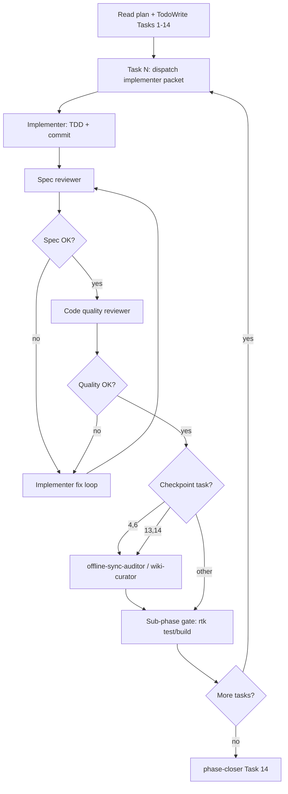

# Festival Wrap (`/wrap`) Implementation Plan

> **For agentic workers:** **Locked execution mode: subagent-driven-development** (see § Subagent execution strategy below). Alternative: `executing-plans` only if the human explicitly opts out. Steps use checkbox (`- [ ]`) syntax for tracking.

**Goal:** Ship a private, offline-first `/wrap` recap page (A2 Vest Chronicle) with five scroll sections, client-side stats from IndexedDB, and post-festival discovery banners on `/now` and `/profile`.

**Architecture:** Pure `buildFestivalWrapStats()` in `festivalWrap.ts` reuses badge-engine semantics (`buildBadgeContext` / `seenBands` / `computeBandOverlaps`) on the same IDB snapshot shape as `useBadgeCache`. `useFestivalWrapStats` loads IDB + auth metadata; `WrapPage` is presentation-only. No Supabase reads for stats; no schema migration.

**Tech stack:** React + Vite, IndexedDB (`src/lib/db/`), existing badge services, `isFestivalEnded()` from `src/services/time.ts`, CSS modules, i18n (br/en/es/de).

**Spec source:** `FUTURE_IDEAS.md` § Idea 7

**Phase:** 30 — Festival Wrap (sub-phases 30.A–30.E below)

---

## Locked design decisions (approved — do not re-open)

| Surface | Locked variant | Spec |
|---------|----------------|------|
| **`/wrap` page** | **A2 · Vest Chronicle** — 5 scroll sections, 5-dot progress, stage bar, meters, patch finale | `docs/superpowers/specs/2026-05-27-festival-wrap-page-design.md` |
| **Teaser banner** (`/now`, `/profile`) | **B · Vest Chronicle bar** — 4px `--accent` top bar, patch pile, Oswald + mono (not playlist strip, not gold D, not B+D) | `docs/superpowers/specs/2026-05-27-festival-wrap-banner-design.md` |
| **Godlike QA** | D+1 time travel previews **teaser only**; `/wrap` always reachable | `docs/superpowers/specs/2026-05-27-festival-wrap-godlike-qa-design.md` |

**HTML prototypes (local, gitignored):** `_temp/wrap-proposals/variant-a2-vest-chronicle.html` · `_temp/wrap-banner-proposals/index.html` (variant B)

Implementers must match these specs; new banner/page layout explorations are out of scope for Phase 30.

---

## Prerequisites (read before Task 1)

1. `docs/ai-wiki/index.md` → offline-first + badges sections
2. `docs/ai-wiki/badges.md` — `BadgeContext`, seen/picked semantics, vest stack
3. `docs/superpowers/specs/2026-05-27-festival-wrap-page-design.md` + `docs/superpowers/specs/2026-05-27-festival-wrap-banner-design.md` — **locked UI** (read before any UI task)
4. `FUTURE_IDEAS.md` — Idea 7 stats + acceptance criteria
5. `src/services/badges/badgeContextBuilder.ts` — `BadgeIdbSnapshot` / `buildBadgeContextFromSnapshot`
6. `src/services/badges/engine.ts` — `seenBands`, `getEarnedBadges`
7. `src/hooks/useBandConflicts.ts` — `computeBandOverlaps`
8. `src/pages/PopularPage.tsx` — crew #1 band sort + `totalViraLatas` pattern
9. `docs/superpowers/specs/2026-05-27-festival-wrap-godlike-qa-design.md` — teaser vs `/wrap` route, D+1, Time Travel disclaimer
10. `src/components/profile/TimeTravelSection.tsx` + `ConsolidateBadgesSection.tsx` — time-override reactivity pattern

**Verification gates (every sub-phase):** `rtk npm run build` · `rtk npm test`

---

## File map (create / modify)

| File | Responsibility |
|------|----------------|
| `src/services/festivalWrap.ts` | Types + `buildFestivalWrapStats(snapshot, userId, authUser)` |
| `src/hooks/useFestivalWrapStats.ts` | IDB load (mirror `useBadgeCache` minus persist) + memoized stats |
| `src/lib/wrapDismiss.ts` | `viralatas:wrap-dismissed-2026` localStorage helpers |
| `src/pages/WrapPage.tsx` | Five sections, scroll-snap, `IntersectionObserver` progress |
| `src/pages/WrapPage.module.css` | A2 vest: stage bar, meters, denim finale |
| `src/components/wrap/WrapProgress.tsx` | Fixed 5-dot bar |
| `src/components/wrap/WrapTeaserBanner.tsx` + `.module.css` | **Variant B** dismissible bar → `/wrap` |
| `src/i18n/WrapPage_br.json` (+ en, es, de) | All copy; **vira-latas** not crew |
| `src/App.tsx` | Private route `/wrap` |
| `src/pages/RightNowPage.tsx` | Mount teaser when gated; listen `viralatas:time-override-changed` |
| `src/pages/ProfilePage.tsx` | Mount teaser when gated; listen `viralatas:time-override-changed` |
| `src/components/profile/TimeTravelSection.tsx` | Always-visible wrap QA disclaimer (godlike) |
| `src/i18n/ProfilePage_*.json` | `timeTravelWrapDisclaimer` (br, en, es, de) |
| `src/__tests__/festivalWrap.test.ts` | Stats edge cases |
| `src/__tests__/wrapDismiss.test.ts` | Dismiss key round-trip |
| `public/Design System.html` | Wrap section anatomy |
| `docs/ai-wiki/flows/festival-wrap.md` | New flow page (wiki-curator after ship) |
| `docs/ai-wiki/routes.md` | Add `/wrap` |
| `docs/ai-wiki/changelog.md` | Dated entry on completion |

---

## Sub-phase 30.A — Pure stats builder (TDD)

### Task 1: Types and empty state

**Files:**
- Create: `src/services/festivalWrap.ts`
- Test: `src/__tests__/festivalWrap.test.ts`

- [ ] **Step 1: Write failing tests for empty picks**

```typescript
import { describe, expect, it } from 'vitest';
import { buildFestivalWrapStats, EMPTY_WRAP_STATS } from '../services/festivalWrap';
import { buildBadgeContextFromSnapshot, EMPTY_BADGE_CONTEXT } from '../services/badges/badgeContextBuilder';
// Use minimal snapshot factories from badges.test patterns

describe('buildFestivalWrapStats', () => {
  it('returns hasPicks false when user has zero picks', () => {
    const stats = buildFestivalWrapStats(minimalSnapshot({ userPicks: [] }), 'u1', authUser());
    expect(stats.hasPicks).toBe(false);
    expect(stats.personal.bandsPicked).toBe(0);
  });
});
```

- [ ] **Step 2: Run test — expect FAIL** (`buildFestivalWrapStats` not exported)

Run: `rtk npm test -- src/__tests__/festivalWrap.test.ts`
Expected: FAIL — cannot find module / function

- [ ] **Step 3: Implement minimal types + empty branch**

```typescript
export type FestivalWrapPersonal = {
  bandsPicked: number;
  bandsSeen: number;
  bandsSkipped: number;
  topGenre: string | null;
  topStage: string | null;
  stageDiversity: number;
  hardConflicts: number;
  softConflicts: number;
  weakSkips: number;
  badgesEarnedCount: number;
  earnedBadgeSlugs: string[];
  maxCrewAtPick: number;
  locationVisitsTotal: number | null; // null when friend — hide in UI
};

export type FestivalWrapCrew = {
  topBandName: string | null;
  topBandPickCount: number;
  activeViraLatas: number;
  pickTwinUserId: string | null;
  pickTwinDisplayName: string | null;
  pickTwinOverlapPct: number | null;
};

export type FestivalWrapStats = {
  hasPicks: boolean;
  personal: FestivalWrapPersonal;
  crew: FestivalWrapCrew;
};

export const EMPTY_WRAP_STATS: FestivalWrapStats = { /* zeros + nulls */ };

export function buildFestivalWrapStats(
  snap: BadgeIdbSnapshot,
  userId: string,
  authUser: AuthUser,
): FestivalWrapStats { /* delegate badge ctx; return EMPTY when bandsPicked === 0 */ }
```

- [ ] **Step 4: Run test — PASS**

- [ ] **Step 5: Commit** `Phase 30.A: festival wrap stats scaffold`

---

### Task 2: Personal stats parity with badge engine

**Files:**
- Modify: `src/services/festivalWrap.ts`
- Test: `src/__tests__/festivalWrap.test.ts`

- [ ] **Step 1: Failing test — seen / skipped match engine**

Copy fixture bands from `src/__tests__/missed.test.ts` (`buildBadgeContext — seenBands`). Assert:
- `bandsSeen === ctx.seenBands.length`
- `bandsSkipped ===` picked ended bands in `missedBandIds`
- `topGenre` / `topStage` = mode from `seenBands` (tie-break: higher count, then alphabetical stage/genre name)

- [ ] **Step 2: Run — FAIL**

- [ ] **Step 3: Implement**

Inside `buildFestivalWrapStats`:
1. `const ctx = buildBadgeContextFromSnapshot(snap, userId, authUser)`
2. `const earned = getEarnedBadges(ctx)` (import from `engine.ts`)
3. `const overlaps = computeBandOverlaps(ctx.pickedBands)` — count unique pairs where `severity === 'hard'|'soft'` (each unordered pair once; mirror `ConflictSection` display counts if it aggregates differently — match that UX number)
4. `weakSkips` from `getWeakSkipCount(authUser.user_metadata)`
5. `locationVisitsTotal`: if `snap.isCurrentUserFriend` → `null`; else sum `Object.values(ctx.locationVisits)`

- [ ] **Step 4: Run — PASS**

- [ ] **Step 5: Commit** `Phase 30.A: personal wrap stats from BadgeContext`

---

### Task 3: Crew stats (pick twin + #1 band)

**Files:**
- Modify: `src/services/festivalWrap.ts`
- Test: `src/__tests__/festivalWrap.test.ts`

- [ ] **Step 1: Failing tests**

```typescript
it('crew top band matches PopularPage sort (max pick count)', () => { /* 3 users, 2 picks on band A */ });
it('pick twin is highest Jaccard overlap excluding self', () => { /* u1 picks {a,b}, u2 {a,b,c} → 100% vs u3 {x} */ });
it('activeViraLatas counts unique pickers', () => { /* dedupe user_id in allPicks */ });
```

**Jaccard:** `|A∩B| / |A∪B|` on pick band_id sets per crew user; exclude `userId`; require `|A| > 0` for twin eligibility.

**Crew #1 band:** Same as `PopularPage` — max `allPickCounts`, tie `start_time` ascending; exclude `ceremony`.

- [ ] **Step 2: Run — FAIL**

- [ ] **Step 3: Implement** `computeCrewWrapStats(snap, userId)` private helper in same file

- [ ] **Step 4: Run — PASS**

- [ ] **Step 5: Commit** `Phase 30.A: crew wrap stats`

---

### Task 4: Friend user + sparse missed

**Files:**
- Test: `src/__tests__/festivalWrap.test.ts`

- [ ] **Step 1: Tests**

- `isCurrentUserFriend: true` → `locationVisitsTotal === null`
- Thin missed data: user with picks but 0 missed → `bandsSkipped === 0`, page still `hasPicks: true`

- [ ] **Step 2–4: Implement if gaps, run PASS**

- [ ] **Step 5: Commit** `Phase 30.A: wrap stats edge cases`

---

## Sub-phase 30.B — Hook + dismiss helper

### Task 5: `wrapDismiss.ts`

**Files:**
- Create: `src/lib/wrapDismiss.ts`
- Test: `src/__tests__/wrapDismiss.test.ts`

- [ ] **Step 1: Test** `isWrapDismissed` / `dismissWrapTeaser` use key `viralatas:wrap-dismissed-2026`

- [ ] **Step 2–4: Implement** (mirror `patchesBackground.ts` event optional — not required for v1)

- [ ] **Step 5: Commit**

---

### Task 6: `useFestivalWrapStats`

**Files:**
- Create: `src/hooks/useFestivalWrapStats.ts`

- [ ] **Step 1: Copy load pattern from `useBadgeCache`** — same `Promise.all` IDB reads; **do not** call `useBadgePersist`

- [ ] **Step 2: `useMemo(() => buildFestivalWrapStats(...))`** when snapshot ready

- [ ] **Step 3: Export `{ stats, loading, error }`**

- [ ] **Step 4: Optional light test** mock IDB via existing `useBadgeCache.test` patterns OR rely on `festivalWrap.test.ts` + manual QA

- [ ] **Step 5: Commit** `Phase 30.B: useFestivalWrapStats hook`

---

## Sub-phase 30.C — Route + page shell

### Task 7: Register `/wrap`

**Files:**
- Modify: `src/App.tsx`

- [ ] **Step 1: Import `WrapPage`, add `<PrivateRoute><WrapPage /></PrivateRoute>` at `/wrap`**

- [ ] **Step 2: Build passes**

- [ ] **Step 3: Commit**

---

### Task 8: `WrapPage` scaffold (no scroll polish yet)

**Files:**
- Create: `src/pages/WrapPage.tsx`, `WrapPage.module.css`
- Create: `src/i18n/WrapPage_br.json` (+ en, es, de) — register in `src/lib/i18n.ts` like other pages

- [ ] **Step 1: Loading / empty / ready states**

- `loading` → mono kicker + spinner text
- `!stats.hasPicks` → friendly empty (`emptyTitle`, `emptyBody`) per spec
- `hasPicks` → placeholder five `<section data-wrap-section>` with `aria-label` from i18n

- [ ] **Step 2: Set `document.documentElement.style.setProperty('--stage', stageColorVar(topStage))` when stats ready**

- [ ] **Step 3: Commit** `Phase 30.C: WrapPage shell`

---

## Sub-phase 30.D — A2 Vest UI (five sections)

**Design spec (locked):** `docs/superpowers/specs/2026-05-27-festival-wrap-page-design.md` — do not change section count, scroll model, or A2 visual rules without a new design approval.

### Task 9: `WrapProgress` + scroll-snap

**Files:**
- Create: `src/components/wrap/WrapProgress.tsx`
- Modify: `WrapPage.tsx`, `WrapPage.module.css`

- [ ] **Step 1: CSS** — `scroll-snap-type: y mandatory` on container; each section `min-height: 100dvh; scroll-snap-align: start`

- [ ] **Step 2: `IntersectionObserver`** on five sections → active dot index (0–4)

- [ ] **Step 3: Fixed top bar** — 5 dots, accent fill on active (match prototype spacing)

- [ ] **Step 4: Each section card** — 4px top bar `background: var(--stage)` (fallback `var(--accent)`)

- [ ] **Step 5: Commit** `Phase 30.D: wrap scroll + progress`

---

### Task 10: Sections 1–3 (Hero, Personality, Chaos)

**Files:**
- Modify: `WrapPage.tsx`, i18n files, CSS

| Section | Key elements |
|---------|----------------|
| Hero | Giant `bandsSeen`; secondary row: picked · skipped · `stageDiversity` |
| Personality | `topGenre` + `topStage` copy; pill `t('stagePill', { stage, count })` |
| Chaos | Three horizontal meters: weak skips, hard conflicts, badges earned (cap bar width at 100% with sane max — e.g. max weak skips 20 for display scale) |

- [ ] **Implement + i18n keys**

- [ ] **Commit** `Phase 30.D: wrap sections 1-3`

---

### Task 11: Sections 4–5 (Crew, Patches finale)

**Files:**
- Modify: `WrapPage.tsx`, CSS

| Section | Key elements |
|---------|----------------|
| Crew | Pick twin name + overlap %; crew #1 band + pick count + `activeViraLatas` |
| Patches | Reuse `buildStackPoses` + `stackStyle` from `stackLayout.ts` on `earnedBadgeSlugs` mapped through `BADGES` registry; denim `data-bg` from `loadPatchesBackground()`; CTA `<Link to="/profile">` `t('openVest')` |

**Note:** Finale is decorative scatter (non-clickable), not full `BadgesDisplay` modal behavior.

- [ ] **Hide location stats** — never render when `locationVisitsTotal === null`

- [ ] **Commit** `Phase 30.D: wrap crew + patches finale`

---

## Sub-phase 30.E — Discovery, docs, wiki

### Task 12: `WrapTeaserBanner` (Variant B — locked)

**Design spec:** `docs/superpowers/specs/2026-05-27-festival-wrap-banner-design.md`

**Files:**
- Create: `src/components/wrap/WrapTeaserBanner.tsx`, `WrapTeaserBanner.module.css`
- Create: `src/i18n/WrapTeaserBanner_br.json` (+ en, es, de) — or keys under `WrapPage_*` if barrel prefers one namespace
- Modify: `RightNowPage.tsx`, `ProfilePage.tsx`

**Gate (all required):**
```typescript
const show =
  isFestivalEnded(now(), bands) &&
  !isWrapDismissed() &&
  !loadingBands;
```

Use `now()` from `time.ts` — never raw `new Date()` for the gate.

- [ ] **Subscribe to `viralatas:time-override-changed`** — recompute `show` when godlike changes Time Travel (mirror `ConsolidateBadgesSection.tsx` lines 37–45)

- [ ] **Implement Variant B layout** — `--bg-surface` bar; `::before` or child **4px** `var(--accent)` top bar; decorative 3-patch pile; mono kicker + Oswald headline + mono CTA; dismiss column (not gold wash, not ’26 circle, not playlist strip)

- [ ] **Placement** — `/now` below header; `/profile` below `ProfileHeader` (per banner spec)

- [ ] **Link to `/wrap`**, dismiss button calls `dismissWrapTeaser()`

- [ ] **Route `/wrap` always reachable when logged in** — no `isFestivalEnded` guard on the page (see godlike QA spec)

- [ ] **Commit** `Phase 30.E: wrap teaser banner (variant B)`

---

### Task 12b: Time Travel wrap disclaimer (godlike QA)

**Spec:** `docs/superpowers/specs/2026-05-27-festival-wrap-godlike-qa-design.md`

**Files:**
- Modify: `src/components/profile/TimeTravelSection.tsx`
- Modify: `src/i18n/ProfilePage_br.json`, `ProfilePage_en.json`, `ProfilePage_es.json`, `ProfilePage_de.json`

- [ ] **Add key `timeTravelWrapDisclaimer`** in all four locales (wrap teaser only; mention D+1; `/wrap` always testable; do **not** mention consolidate)

- [ ] **Render** second `<p>` under `timeTravelDescription` with same muted description styling

- [ ] **Manual QA:** godlike → Profile → Time Travel → read disclaimer → D+1 → teaser on `/now` without reload → Clear → teaser hides if real time is pre-festival

- [ ] **Commit** `Phase 30.E: time travel wrap QA disclaimer`

---

### Task 13: Design System + wiki

**Files:**
- Modify: `public/Design System.html`
- Create: `docs/ai-wiki/flows/festival-wrap.md` (8-section wiki template)
- Modify: `docs/ai-wiki/routes.md`, `docs/ai-wiki/changelog.md`, `docs/ai-wiki/index.md` (link flow)

- [ ] **Design System:** `WrapTeaserBanner` Variant B anatomy + `/wrap` A2 page section table, tokens, `--stage` dynamic color, progress bar (per page + banner specs)

- [ ] **Wiki flow:** IDB-only reads, gating table, files list, acceptance criteria mirrored from PHASES.md

- [ ] **Commit** `Phase 30.E: wrap docs`

---

### Task 14: Phase close checklist

- [ ] All acceptance criteria in `PHASES.md` Phase 30 checked
- [ ] `FUTURE_IDEAS.md` Idea 7 status → `✅ Phase 30`
- [ ] Append `docs/ai-wiki/phases-history.md` entry
- [ ] `rtk npm run build` + `rtk npm test` green
- [ ] Single phase commit per project rules (user-requested)

---

## Acceptance criteria (Phase 30 = Idea 7)

- [ ] `/wrap` renders five scroll sections with A2 Vest visual language (stage bar, meters, patch pile, progress dots)
- [ ] All displayed stats match badge engine semantics for seen/picked/skipped/conflicts
- [ ] Page works fully offline after first load (stats from IndexedDB only)
- [ ] Teaser banner **Variant B** on `/now` and `/profile`; gated by `isFestivalEnded(now(), bands)`; respects `viralatas:wrap-dismissed-2026`
- [ ] Godlike D+1 time travel shows teaser on `/now` and `/profile` without reload; Time Travel shows wrap-only disclaimer (4 locales)
- [ ] `/wrap` has no festival-ended route gate
- [ ] Copy uses **vira-latas** (not "crew") in all four locales
- [ ] Friend users never see location-toggle stats on the wrap page
- [ ] Empty-picks users see a friendly empty state, not broken layout
- [ ] "Open vest" navigates to `/profile` where `BadgesDisplay` shows full patch collection
- [ ] Design System documents Wrap page tokens and section anatomy

---

## Out of scope (v1 — do not implement)

| Item | Reason |
|------|--------|
| Duck quack stats | Not in IDB |
| LLM day recap | Idea 1 |
| Public share URL / server snapshot | No persistence |
| Percentile rank copy | Optional v2 |
| Bottom nav tab for `/wrap` | Discovery via banner + direct URL only |

---

## Self-review (plan author)

| Spec requirement | Task |
|------------------|------|
| Five sections A2 | Tasks 9–11 |
| Badge semantics | Tasks 2–4 |
| Offline IDB | Tasks 6, 14 |
| Teaser banner Variant B | Task 12 |
| `isFestivalEnded` gate + godlike D+1 | Tasks 12, 12b |
| `/wrap` open anytime | Task 12 (no route gate) |
| Friend privacy | Tasks 2, 11 |
| Empty picks | Task 1, 8 |
| Open vest CTA | Task 11 |
| No LLM / no schema | Architecture header |

**Placeholder scan:** None — all tasks name concrete files and behaviors.

---

## Subagent execution strategy (locked default)

**Skill:** `superpowers:subagent-driven-development` — fresh implementer subagent per **Task** (1–14), then **spec review**, then **code quality review**, before advancing. Do **not** dispatch multiple implementers in parallel (merge conflicts on shared files).

**Controller (parent agent) responsibilities:**

1. Read this plan once; extract Tasks 1–14 and **12b** with full step text into a TodoWrite checklist.
2. Confirm branch/worktree on a feature branch (not `main` unless user explicitly approved).
3. For each task: paste **Dispatch packet** (below) into a new `generalPurpose` implementer subagent — never ask the subagent to re-read this file.
4. After implementer reports **DONE** or **DONE_WITH_CONCERNS**: run spec reviewer → fix loop → code quality reviewer → fix loop.
5. Run project specialists at checkpoints (table below).
6. After Task 14: delegate **`phase-closer`** (build, test, wiki-curator, phases-history, single commit) per `CLAUDE.md`.

**Continuous execution:** Execute Tasks 1→14 without pausing for "continue?" between tasks. Stop only on **BLOCKED**, genuine ambiguity, or all tasks complete.

---

### Dispatch packet (paste into every implementer subagent)

Each packet must be self-contained. Include:

```markdown
## Project
Viralatas Metaleiros — offline-first PWA. UI reads IndexedDB first; Supabase is sync only.
Product copy: **vira-latas** (never "crew" in user-facing strings).

## Phase
30 — Festival Wrap (`/wrap`). Sub-phase: [30.A|30.B|30.C|30.D|30.E].

## Task N (full text)
[Paste entire Task N section from this plan: steps, files, code samples, commit message.]

## Constraints (non-negotiable)
- No Supabase reads for wrap stats; reuse `buildBadgeContextFromSnapshot` semantics.
- `seenBands` / skipped / conflicts must match `engine.ts` + `computeBandOverlaps`.
- Friend users: `locationVisitsTotal` null — never render location stats.
- `/wrap` route always reachable when logged in; teaser gated by `isFestivalEnded(now(), bands)` only. Godlike D+1 previews teaser, not route lock (Task 12b: wrap-only Time Travel disclaimer).
- No schema migrations; no Edge Functions; no client API keys.
- Prefix shell commands with `rtk` (e.g. `rtk npm test -- src/__tests__/festivalWrap.test.ts`).
- One commit per task with message from plan (or `Phase 30.X: …`).

## Wiki
Do not update wiki/Design System/changelog unless this task is 13 or 14 — Task 13 owns docs.

## Visual reference (Tasks 9–11 only)
`_temp/wrap-proposals/variant-a2-vest-chronicle.html` — A2 Vest Chronicle layout.

## Report status
DONE | DONE_WITH_CONCERNS | NEEDS_CONTEXT | BLOCKED
```

---

### Task → sub-phase → model → specialist audit

| Task | Sub-phase | Implementer model | Notes |
|------|-----------|-------------------|--------|
| 1 | 30.A | fast | Types + empty state; 1–2 files |
| 2 | 30.A | fast | Badge parity tests — copy fixtures from `missed.test.ts` |
| 3 | 30.A | standard | Crew Jaccard + PopularPage sort — integration logic |
| 4 | 30.A | fast | Edge cases only |
| 5 | 30.B | fast | `wrapDismiss.ts` mirror `patchesBackground.ts` |
| 6 | 30.B | standard | `useFestivalWrapStats` — multi-file, mirror `useBadgeCache` |
| 7 | 30.C | fast | `App.tsx` route only |
| 8 | 30.C | standard | Page shell + i18n registration |
| 9 | 30.D | standard | Scroll-snap + `IntersectionObserver` |
| 10 | 30.D | standard | Sections 1–3 + 4 locale files |
| 11 | 30.D | standard | Crew + patch pile; reuses `stackLayout.ts` |
| 12 | 30.E | standard | **Variant B** `WrapTeaserBanner` + two page mounts + `time-override-changed` |
| 12b | 30.E | fast | Time Travel disclaimer + ProfilePage i18n only |
| 13 | 30.E | fast | Docs/HTML only — invoke **wiki-curator** subagent instead of generic implementer |
| 14 | 30.E | standard | Phase metadata — invoke **phase-closer** subagent |

**Model guidance:** fast = `composer-2.5-fast` or equivalent; standard = default capable model; architecture/review = most capable available.

---

### Per-task review pipeline

```text
Implementer (Task N)
    → Spec reviewer (readonly generalPurpose)
        checklist: task steps all [x], no out-of-scope items, acceptance criteria touched by this task
    → Code quality reviewer (readonly generalPurpose)
        checklist: offline-first, no Supabase in stats path, i18n vira-latas, tests meaningful
    → Mark Task N complete in TodoWrite
```

**Spec reviewer prompt (short):**

- Compare git diff to **Task N** text only.
- Flag missing behavior, extra features, wrong file paths.
- For Tasks 2–4: require stat parity with `BadgeContext` / `PopularPage` sort.
- For Task 12: teaser must not gate `/wrap` page itself; must use `now()` and listen for `viralatas:time-override-changed`.
- For Task 12: must match `festival-wrap-banner-design.md` Variant B (reject gold D / B+D / playlist A).
- For Task 12b: disclaimer always visible; wrap-only copy per godlike QA spec.
- For Tasks 9–11: must match `festival-wrap-page-design.md` A2 (five sections, no carousel).

**Code quality reviewer prompt (short):**

- Offline-first: no `supabase.from` in `festivalWrap.ts` / `useFestivalWrapStats`.
- No duplicated badge seen-band logic — must call `buildBadgeContextFromSnapshot`.
- CSS uses `stageColorVar` / design tokens, not hardcoded stage hex.
- Tests assert behavior, not implementation details.

**Order rule:** Never run code quality review before spec compliance is ✅.

**Fix loops:** Same implementer subagent (or fresh implementer with "fix spec issues: …" packet) until both reviewers approve.

---

### Project specialist checkpoints

Run **after** the task row's code is merged locally (not in parallel with another implementer).

| After task(s) | Subagent | Trigger |
|---------------|----------|---------|
| 4 (end 30.A) | `offline-sync-auditor` | New stats service + IDB snapshot — confirm UI→IDB, no inverted reads |
| 6 (end 30.B) | `offline-sync-auditor` | Hook loads IDB same as badges; no persist side effects |
| 11 (end 30.D) | — | Optional: human visual check against A2 HTML prototype |
| 13 | `wiki-curator` | **Use as implementer for Task 13** — DS + `festival-wrap.md` + routes + changelog |
| 14 | `phase-closer` | **Use as implementer for Task 14** — build, test, phases-history, single commit |

Do **not** invoke `migration-validator` or `edge-function-reviewer` (no migrations / edge functions in Phase 30).

---

### Sub-phase integration gates

Before starting the next sub-phase, controller runs locally:

| Gate | After | Command |
|------|-------|---------|
| G1 | 30.A (Tasks 1–4) | `rtk npm test -- src/__tests__/festivalWrap.test.ts` |
| G2 | 30.B (Tasks 5–6) | `rtk npm test` (full suite) |
| G3 | 30.C (Tasks 7–8) | `rtk npm run build` |
| G4 | 30.D (Tasks 9–11) | `rtk npm run build` + manual `/wrap` smoke if dev server up |
| G5 | 30.E (Tasks 12–14) | `rtk npm run build` · `rtk npm test` · `offline-sync-auditor` on full diff |

---

### Controller session flow (mermaid)



---

### Red flags (Phase 30 specific)

- Implementer adds Supabase fetch for wrap stats → **reject** in spec review.
- Implementer duplicates `seenBands` filter instead of `buildBadgeContextFromSnapshot` → **reject**.
- Implementer gates `/wrap` on `isFestivalEnded()` → **reject** (banner only).
- Parallel implementers on `WrapPage.tsx` → **forbidden**.
- Skipping tests on Tasks 1–4 → **forbidden**.
- Task 13 implementer changes runtime code unrelated to docs → **reject**.
- Commit to `main` without user OK → **stop**.

---

### Alternative: inline execution

Use `superpowers:executing-plans` only when the human explicitly requests same-session inline work **without** per-task subagents. Checkpoints remain G1–G5; reviews become manual. Default remains subagent-driven above.

---

## Execution handoff

**Default:** Start Phase 30 with subagent-driven-development using this section. Controller announces: *"Using subagent-driven development for Phase 30 Festival Wrap — Task 1."* Run **Task 12b** after Task 12 (same sub-phase 30.E).

**Human opt-in required for:** inline execution, commits to `main`, or skipping specialist audits at G1/G2/G5.
